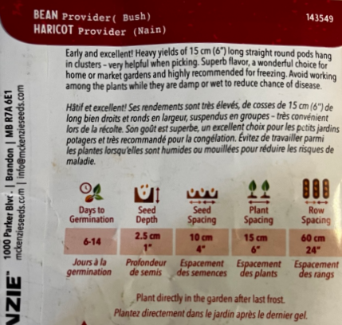

# 🫘 インゲン豆（Bush Bean / Provider）

## 特徴

* 早生で収量多い
* 約15cmのまっすぐな豆
* 冷凍保存にも向く
* **ブッシュタイプ（支柱不要）**

## 栽培条件

* 湿っている状態で触ると病気になりやすいので注意

## 種まき・育て方

* 発芽：**6〜14日**
* 種の深さ：**2.5cm**
* 種間隔：**10cm**
* 株間：**15cm**
* 畝間：**60cm**

## スケジュール

* **最後の霜の後に直接地植え（直まき）**

👉 ポイント

* 豆は移植NG → **必ず直まき**
* 連続収穫したいなら2〜3週間ごとに追加で種まき
* 窒素肥料は控えめ（葉ばかり茂る）
