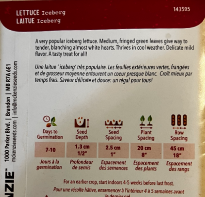

# 🥬 レタス（Iceberg）

## 特徴

* シャキシャキの結球レタス
* 涼しい気候を好む
* 味はマイルドで食べやすい

## 栽培条件

* **冷涼な気候向き（春・秋）**
* 暑すぎると結球しにくい

## 種まき・育て方

* 発芽：**7〜10日**
* 種の深さ：**1.3cm**
* 種間隔：**2.5cm**
* 株間：**20cm**
* 畝間：**45cm**

## スケジュール

* 最終霜の**4〜5週間前に室内スタート**（早取りしたい場合）

Seed starting mixを明るい窓際に置いたプランターに入れて、深さ1cmちょいに種を植える。最初にしっかり湿らせ、その後は乾いたら軽く水やり。

👉 ポイント

* スコーミッシュの気候ならかなり育てやすい
* 夏は「半日陰」くらいが良い
* 水切れすると苦くなるので注意
