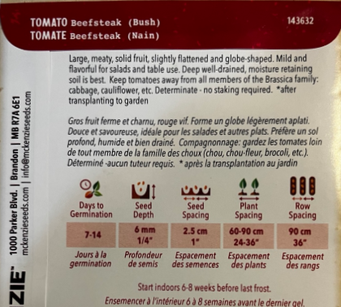

# 🍅 トマト（Beefsteak / ブッシュタイプ）

## 特徴

* 大きくて肉厚なトマト（ステーキ用サイズ）
* やや平たい丸型
* サラダや生食に向いている
* **支柱不要（ブッシュ＝矮性タイプ）**

## 栽培条件

* 水はけが良く、適度に水分を保つ土がベスト
* キャベツなどアブラナ科とは離して植える

## 種まき・育て方

* 発芽：**7〜14日**
* 種の深さ：**約6mm**
* 種間隔：**2.5cm**
* 株間：**60〜90cm**
* 畝間：**90cm**

## 🍅 年間スケジュール

### 🌱 ① 種まき（室内）

👉 **3月中旬〜4月初旬（今〜OK）**

* 室内でスタート必須
* 深さ：約6mm
* 発芽：5〜10日くらい（暖かければ早い）

#### ポイント

* **暖かさが超重要（20℃前後）**
* 窓際＋できればヒートマットあると最強

---

### 🌿 ② 育苗期間（室内）

👉 **約6〜8週間**

* 本葉が出てきたら少し大きいポットへ
* 光不足だとヒョロヒョロになる

#### ポイント

* 茎が伸びすぎたら → **深植えでリカバー可能（トマトは強い）**
* 軽く風を当てると丈夫になる

---

### 🌤 ③ ハードニング（外に慣らす）

👉 **4月後半〜5月前半**

* いきなり外はNG
* 1日1〜2時間 → 徐々に時間を増やす（約1週間）

---

### 🌳 ④ 定植（外に植える）

👉 **5月中旬〜下旬（ここ重要）**

スコーミッシュ基準：

* 夜の最低気温が**10℃以上**安定してから

👉 早く植えすぎると

* 成長止まる
* 病気出る
* 最悪枯れる

---

### 🌞 ⑤ 成長期（6〜8月）

#### やること

* 日当たりMAX確保（最重要）
* 水やり：深く、頻繁すぎない
* 下葉は適度にカット（風通し）

#### スコーミッシュ特有の注意

👉 **雨＝病気リスク**

* 葉に水が当たり続ける → カビ系出やすい

✔ 対策

* 軒下 or 簡易ビニールカバー
* 下葉を間引く
* 地面から離す（泥はね防止）

---

### 🍅 ⑥ 収穫

👉 **7月後半〜9月**

* Beefsteakはやや遅め
* 赤くなり始めたらOK

---

## 🌧 スコーミッシュの天候の攻略ポイント（超重要）

### ① 品種はすでに正解

👉 ブッシュタイプ（今回のやつ）

* 寒さ・風に比較的強い
* 支柱いらず

---

### ② とにかく「日照確保」

* 曇り多い地域なので
  👉 **一番日が当たる場所に置く**

---

### ③ 雨対策で差が出る

これやるだけで成功率跳ね上がる👇

* 簡易屋根（透明シート）
* プランター栽培にして移動可能にする

---

### ④ 地植え vs プランター

#### ✔ 地植え

* 水分安定
* ただし雨の影響大

#### ✔ プランター（おすすめ）

* 移動できる
* 雨回避できる
* 土もコントロールしやすい

👉 スコーミッシュなら
**プランターかなり有利**

---

## 🧭 全体スケジュールまとめ

* 最終霜の**6〜8週間前に室内で種まき**
* その後、外に定植

|時期|作業|
|-|-|
|3月|室内で種まき|
|4月|室内育苗＋外慣らし|
|5月中旬〜|定植（外へ）|
|6〜8月|管理・成長|
|7〜9月|収穫|

👉 ポイント

* トマトは「苗作りが8割」
* 日当たり超重要（最低6〜8時間）
* 水やりは「乾いたらたっぷり」
